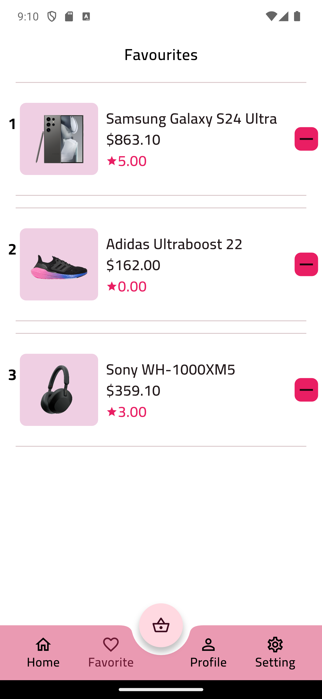
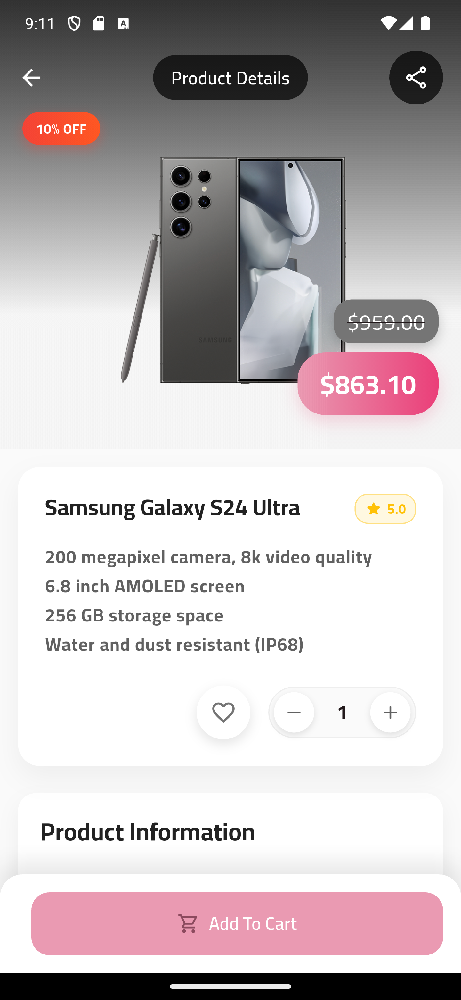
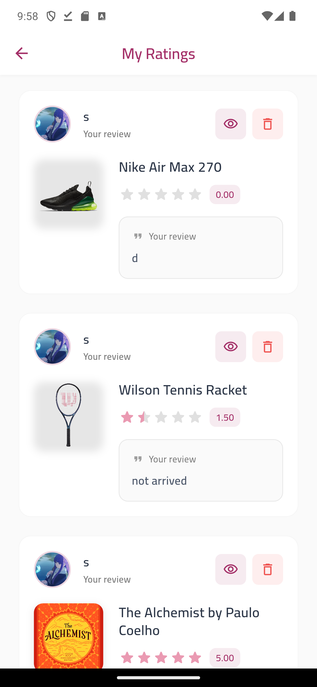

# Sire &nbsp;   

> **A modern, full-stack, multi-role e-commerce platform built with Flutter and PHP.**

---

## 🛍️ Introduction

**Sire** is a comprehensive e-commerce solution designed for customers, delivery personnel, and administrators. It offers a seamless shopping, delivery, and management experience across mobile, web, and desktop platforms. Sire is open-source, modular, and built for scalability and maintainability.

---

## ✨ Features

### **Customer Features**
- **User Authentication:** Sign up, login, password reset, and email verification
- **Product Browsing & Search:** Explore products by category, search, and view details
- **Favorites & Cart:** Add products to favorites and manage your shopping cart
- **Checkout & Orders:** Place orders, apply coupons, and track order status
- **Address Management:** Add, update, and select delivery addresses with GPS coordinates
- **Notifications:** Real-time updates for orders, offers, and system messages
- **Ratings & Reviews:** Rate products and view community feedback
- **Multi-language Support:** Localized for Arabic, English, and Spanish

### **Delivery Features**
- **Order Management:** Accept and manage deliveries, update order status
- **GPS Navigation:** Integrated Google Maps for route optimization
- **Real-time Tracking:** Live order tracking and status updates
- **Delivery History:** Complete delivery history and earnings tracking

### **Admin Features**
- **Dashboard Analytics:** Comprehensive sales and performance metrics
- **Product Management:** Add, edit, and manage products with multi-language support
- **Category Management:** Organize products with hierarchical categories
- **Order Management:** Process orders, manage inventory, and track deliveries
- **User Management:** Manage customer accounts and delivery personnel
- **Coupon System:** Create and manage discount coupons
- **Notification System:** Send push notifications to users and delivery personnel
- **Reports & Analytics:** Detailed sales reports and business insights

---

## 🖼️ Screenshots

### User Interface

|  |  |  |  |  |
|:---:|:---:|:---:|:---:|:---:|
|  |  |  |  |  |
|  |  |  |  |  |
|  |  |  |  |  |
|  |  |  |  | |

### Delivery Interface

|  |  |  |  |  |
|:---:|:---:|:---:|:---:|:---:|
|  |  | | | |

### Admin Interface

|  |  |  |  |  |
|:---:|:---:|:---:|:---:|:---:|
|  |  |  |  |  |
|  |  |  |  |  |
|  |  |  | | |

---

## 🛠️ Technologies Used

### **Frontend (Flutter)**
- [Flutter 3.6.2+](https://flutter.dev/) (Dart)
- [GetX](https://pub.dev/packages/get) (state management, routing)
- [Material Design 3](https://m3.material.io/)
- [Firebase Messaging](https://pub.dev/packages/firebase_messaging) (push notifications)
- [Google Maps Flutter](https://pub.dev/packages/google_maps_flutter) (location services)
- [Lottie](https://pub.dev/packages/lottie) (animations)
- [Cached Network Image](https://pub.dev/packages/cached_network_image) (image caching)
- [Shared Preferences](https://pub.dev/packages/shared_preferences) (local storage)
- [HTTP](https://pub.dev/packages/http) (API communication)
- [Image Picker](https://pub.dev/packages/image_picker) (file uploads)
- [Geolocator](https://pub.dev/packages/geolocator) (GPS services)
- [Flutter Local Notifications](https://pub.dev/packages/flutter_local_notifications) (local notifications)
- [Cloud Firestore](https://pub.dev/packages/cloud_firestore) (real-time database)
- [Syncfusion Charts](https://pub.dev/packages/syncfusion_flutter_charts) (analytics charts)
- [Shimmer](https://pub.dev/packages/shimmer) (loading effects)
- [Permission Handler](https://pub.dev/packages/permission_handler) (device permissions)

### **Backend (PHP)**
- [PHP 8.2+](https://www.php.net/)
- [PDO](https://www.php.net/manual/en/book.pdo.php) (database abstraction)
- [MySQL/MariaDB](https://www.mysql.com/) (database)
- [Firebase Cloud Messaging](https://firebase.google.com/docs/cloud-messaging) (push notifications)
- [JWT](https://jwt.io/) (authentication tokens)
- [CORS](https://developer.mozilla.org/en-US/docs/Web/HTTP/CORS) (cross-origin requests)

### **Database Schema**
- **Users:** Customer accounts with authentication
- **Items:** Products with multi-language support (EN/AR/ES)
- **Categories:** Product categorization
- **Orders:** Order management and tracking
- **Cart:** Shopping cart functionality
- **Favorites:** User wishlists
- **Address:** Delivery addresses with GPS coordinates
- **Rating:** Product reviews and ratings
- **Coupon:** Discount system
- **Delivery:** Delivery personnel management
- **Notification:** Push notification system

### **Other Tools**
- [Git](https://git-scm.com/)
- [Android Studio](https://developer.android.com/studio) / [Xcode](https://developer.apple.com/xcode/)
- [Composer](https://getcomposer.org/) (PHP dependency management)
- [Flutter Launcher Icons](https://pub.dev/packages/flutter_launcher_icons) (app icons)
- [Flutter Native Splash](https://pub.dev/packages/flutter_native_splash) (splash screen)

---

## ⚡ Installation & Setup

### **Prerequisites**
- Flutter 3.6.2+ ([Install Guide](https://docs.flutter.dev/get-started/install))
- PHP 8.2+ and Composer
- MySQL/MariaDB 10.4+
- Git

### **Clone the Repository**
```sh
git clone https://github.com/<your-username>/sire.git
cd sire
```

### **Install Dependencies**

#### Flutter App
```sh
flutter pub get
```

#### PHP Backend
```sh
cd backend
composer install  # If you have composer dependencies
```

### **Configuration**

#### **Database Setup**
1. Create a MySQL database named `ecommerce`
2. Import the database schema:
   ```sh
   mysql -u root -p ecommerce < backend/ecommerce.sql
   ```
3. Update database credentials in `backend/connect.php`:
   ```php
   $dsn = "mysql:host=localhost;dbname=ecommerce";
   $user = "your_username";
   $pass = "your_password";
   ```

#### **API Configuration**
- Update API base URLs in `lib/apilink.dart` to match your backend host
- Ensure CORS headers are properly configured in `backend/connect.php`

#### **Firebase Setup**
1. Create a Firebase project
2. Add your `google-services.json` (Android) and `GoogleService-Info.plist` (iOS)
3. Configure Firebase Cloud Messaging for push notifications

#### **App Icons & Splash Screen**
```sh
# Generate app icons
flutter pub run flutter_launcher_icons

# Generate splash screen
flutter pub run flutter_native_splash:create
```

---

## ▶️ Usage Instructions

### **Run the Backend**
- **Development:**  
  ```sh
  cd backend
  php -S localhost:8000
  ```
- **Production:**  
  Deploy `backend/` to your web server (Apache/Nginx with PHP & MySQL)

### **Run the Flutter App**
- **Development:**  
  ```sh
  flutter run
  ```
- **Production Builds:**  
  - Android: `flutter build apk --release`
  - iOS: `flutter build ios --release`
  - Web: `flutter build web`
  - Windows/Mac/Linux: `flutter build windows|macos|linux`

---

## 🧪 Testing

- **Flutter:**  
  ```sh
  flutter test
  ```
- **Backend:**  
  Use tools like [Postman](https://www.postman.com/) or [cURL](https://curl.se/) to test API endpoints

---

## 🚀 Deployment

### **Flutter App**
- **Web:** Deploy `build/web/` to any static web host (Netlify, Vercel, Firebase Hosting)
- **Mobile:** Distribute built APKs/IPAs through app stores
- **Desktop:** Distribute executables for Windows/Mac/Linux

### **Backend**
- Deploy `backend/` to a PHP-enabled server with MySQL
- Ensure proper file permissions and CORS configuration
- Set up SSL certificates for production

### **Database**
- Use managed database services (AWS RDS, Google Cloud SQL, etc.)
- Implement regular backups and monitoring

---

## 🤝 Contribution

We welcome contributions! Please read our [Contribution Guidelines](CONTRIBUTING.md) for details.

**Quick Start:**
1. Fork the repo and clone your fork
2. Create a new branch: `git checkout -b feature/your-feature-name`
3. Make your changes and commit with clear messages
4. Push to your fork and open a Pull Request

**Code Style:**  
- Use `flutter format .` for Dart code
- Follow [Effective Dart](https://dart.dev/guides/language/effective-dart) guidelines
- Follow PSR-12 for PHP code
- Write clear, descriptive commit messages

---

## 📄 License

This project is licensed under the [MIT License](LICENSE).

---

## 📬 Contact

**Author:** Abdulwahed  
For questions, suggestions, or support, please open an issue or contact via GitHub.

---

> _Sire: A modern, open-source e-commerce platform for everyone._
