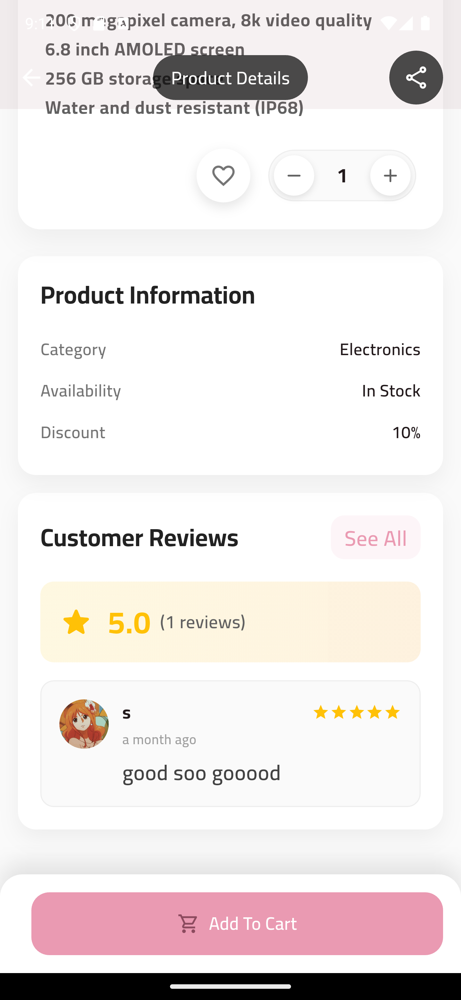

# Sire &nbsp;   

> **A modern, full-stack, multi-role e-commerce platform built with Flutter and PHP.**

---

## 🛍️ Introduction

**Sire** is a comprehensive e-commerce solution designed for customers, delivery personnel, and administrators. It offers a seamless shopping, delivery, and management experience across mobile, web, and desktop platforms. Sire is open-source, modular, and built for scalability and maintainability.

---

## ✨ Features

- **User Authentication:** Sign up, login, password reset, and email verification.
- **Product Browsing & Search:** Explore products by category, search, and view details.
- **Favorites & Cart:** Add products to favorites and manage your shopping cart.
- **Checkout & Orders:** Place orders, apply coupons, and track order status.
- **Address Management:** Add, update, and select delivery addresses.
- **Notifications:** Real-time updates for orders, offers, and system messages.
- **Ratings & Reviews:** Rate products and view community feedback.
- **Admin Dashboard:** Manage products, categories, orders, coupons, and users.
- **Delivery Panel:** Accept and manage deliveries, update order status.
- **Multi-language Support:** Localized for a global audience.
- **Push Notifications:** Integrated with Firebase Cloud Messaging.
- **Modern UI/UX:** Material 3 design, responsive layouts, and smooth animations.

---

## 🖼️ Screenshots

### User Interface

|  |  |  |  |  |
|:---:|:---:|:---:|:---:|:---:|
|  |  |  |  |  |
|  |  |  |  |  |
|  |  |  |  |  |
|  |  |  |  | |

### Delivery Interface

|  |  |  |  |  |
|:---:|:---:|:---:|:---:|:---:|
|  |  | | | |

### Admin Interface

|  |  |  |  |  |
|:---:|:---:|:---:|:---:|:---:|
|  |  |  |  |  |
|  |  |  |  |  |
|  |  |  | | |

---

## 🛠️ Technologies Used

### **Frontend**
- [Flutter](https://flutter.dev/) (Dart)
- [GetX](https://pub.dev/packages/get) (state management, routing)
- [Material Design 3](https://m3.material.io/)
- [Firebase Messaging](https://pub.dev/packages/firebase_messaging)
- [Lottie](https://pub.dev/packages/lottie)
- [Responsive Builder](https://pub.dev/packages/responsive_builder)
- [Various Flutter packages](#flutter-dependencies)

### **Backend**
- [PHP 7.4+](https://www.php.net/)
- [Composer](https://getcomposer.org/)
- [MySQL](https://www.mysql.com/)
- [firebase/php-jwt](https://github.com/firebase/php-jwt)
- [Guzzle](https://github.com/guzzle/guzzle)
- [Monolog](https://github.com/Seldaek/monolog)
- [Symfony Polyfills](https://github.com/symfony/polyfill)

### **Other**
- [Git](https://git-scm.com/)
- [Android Studio](https://developer.android.com/studio) / [Xcode](https://developer.apple.com/xcode/) (for mobile builds)

<details>
<summary>Flutter Dependencies</summary>

See [`pubspec.yaml`](pubspec.yaml) for the full list, including:
- cupertino_icons
- get
- http
- cached_network_image
- image_picker
- google_maps_flutter
- geolocator
- firebase_core
- cloud_firestore
- shared_preferences
- url_launcher
- flutter_svg
- font_awesome_flutter
- dartz
- shimmer
- permission_handler
- and more.
</details>


---

## ⚡ Installation & Setup

### **Prerequisites**
- Flutter 3.0+ ([Install Guide](https://docs.flutter.dev/get-started/install))
- PHP 7.4+ and Composer
- MySQL
- Git

### **Clone the Repository**
```sh
git clone https://github.com/<your-username>/sire.git
cd sire
```

### **Install Dependencies**

#### Flutter App
```sh
flutter pub get
```

#### PHP Backend
```sh
cd backend
composer install
```

### **Configuration**

- **Database:**  
  - Create a MySQL database (default: `ecommerce`).
  - Update credentials in `backend/connect.php`.
  - Import your schema/data if needed.

- **API URLs:**  
  - Update API base URLs in `lib/apilink.dart` to match your backend host.

- **Firebase:**  
  - Add your `google-services.json` (Android) and `GoogleService-Info.plist` (iOS) for push notifications.

---

## ▶️ Usage Instructions

### **Run the Backend**
- **Development:**  
  ```sh
  cd backend
  php -S localhost:8000
  ```
- **Production:**  
  Deploy `backend/` to your web server (Apache/Nginx with PHP & MySQL).

### **Run the Flutter App**
- **Development:**  
  ```sh
  flutter run
  ```
- **Production Builds:**  
  - Android: `flutter build apk --release`
  - iOS: `flutter build ios --release`
  - Web: `flutter build web`
  - Windows/Mac/Linux: `flutter build windows|macos|linux`

---

## 🧪 Testing

- **Flutter:**  
  ```sh
  flutter test
  ```
- **Backend:**  
  Use tools like [Postman](https://www.postman.com/) or [cURL](https://curl.se/) to test API endpoints.

---

## 🚀 Deployment

- **Flutter Web:**  
  Deploy `build/web/` to any static web host (Netlify, Vercel, Firebase Hosting, etc.).
- **Mobile/Desktop:**  
  Distribute built APKs, IPAs, or executables.
- **Backend:**  
  Deploy `backend/` to a PHP-enabled server with MySQL.  
  Ensure CORS and file permissions are set correctly.

> _For CI/CD, see the sample GitHub Actions workflow in the documentation or set up your preferred pipeline._

---

## 🤝 Contribution

We welcome contributions! Please read our [Contribution Guidelines](CONTRIBUTING.md) for details.

**Quick Start:**
1. Fork the repo and clone your fork.
2. Create a new branch: `git checkout -b feature/your-feature-name`
3. Make your changes and commit with clear messages.
4. Push to your fork and open a Pull Request.

**Code Style:**  
- Use `flutter format .` for Dart code.
- Follow [Effective Dart](https://dart.dev/guides/language/effective-dart) and PSR-12 for PHP.
- Write clear, descriptive commit messages.

---

## 📄 License

This project is licensed under the [MIT License](LICENSE).

---

## 📬 Contact

**Author:** Abdulwahed  
For questions, suggestions, or support, please open an issue or contact via GitHub.

---

> _Sire: A modern, open-source e-commerce platform for everyone._
